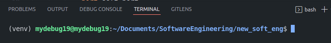

# Software Engineering - Virtual Environment in Python
---
## Installation
1. Create new folder for the project
2. Inside the folder, it will consist of:
    1. **src**, a folder that included the **studi_kasus_2.py**
    2. **data**, a folder that included the **Mall_Customer.csv**
    3. **venv**, The Python Virtual Environment
    4. **License**, MIT License
    5. **main.py**, this python file will importing the class **studi__kasus_2.py** file, for processing the **Mall_Customer.csv**
    6. **Readme**, The file for documentation
    7. **requirements.txt**, The file are generated from `pip freeze > requirements.txt`.This line of code are documenting all the downloaded module/library in **venv** as Python Virtual Environment
 3. This repository can be downloaded as a .zip file or cloning it by using git bash with command `git clone [The Repository Url Address]`. The Url Address are in **code** button in upper right of list of repository, in HTTPS option
 4. For activate the Virtual Environment, in terminal type the command:
     1. For Windows, type `source venv/Scripts/activate`. For this repository, the Virtual Environment will be not supported since imported by Linux Environment.
     2. For Linux and MacOS (example for the creator using Ubuntu 21.04 LTS), type `source venv/bin/activate`
 5. If the OS environment are Windows, it's possible to get an error since the **venv** are imported from Linux Environemnt. **Solutions**
     1. inside imported repository, open terminal and type `pip install virtualenv` for the Virtual Environment library.
     2. after finish, type `virtualenv [virtual-name]` for creating the Virtual Environment. The command can be used for Linux/MacOS enviroment as well.
     3. Back to step 4.2 for activate the Virtual Environment.
 6. The Project are set and ready for next step.
---
## Library Installation
**Caution** Make Sure the Virtual Enviroment already active

There are several python library for this project, which are:
1. `pip3 install matplotlib` or `pip install matplotlib` for Windows
2. `pip3 install pandas` or `pip install pandas` for Windows
3. `pip3 install sqlalchemy` or `pip install sqlalchemy` for Windows
4. `pip3 install mysql-connector-python` or `pip install mysql-connector-python` for Windows
5. `pip3 install psycopg2` or `pip install psycopg2` for Windows
6. `pip3 install tkinter` or `pip install tkinter` for Windows
7. `pip3 install Django` or `pip install Django` for Windows
if documetation are needed, type in terminal `pip freeze > requiremnets.txt` for the installed library info.
---
## Run the File
**Caution** Make Sure the Virtual Enviroment already active

The Project Environment are set, just type `python main.py` or `python3 main.py` for Linux/MacOS

## Deactivate Virtual Environment
For deactivate the Virtual Environment, just type `deactivate` and then enter. it will deactivate the **venv** and back to local python setup
